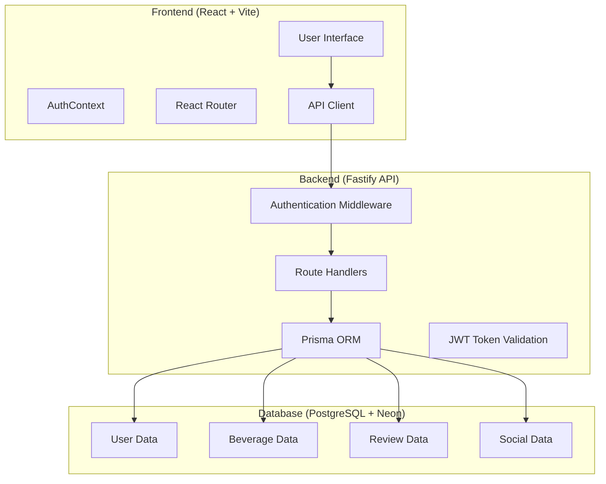
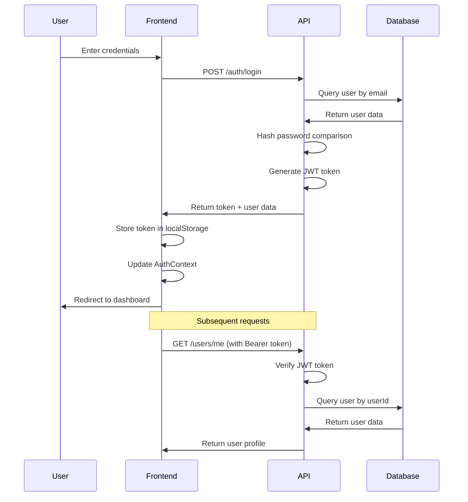
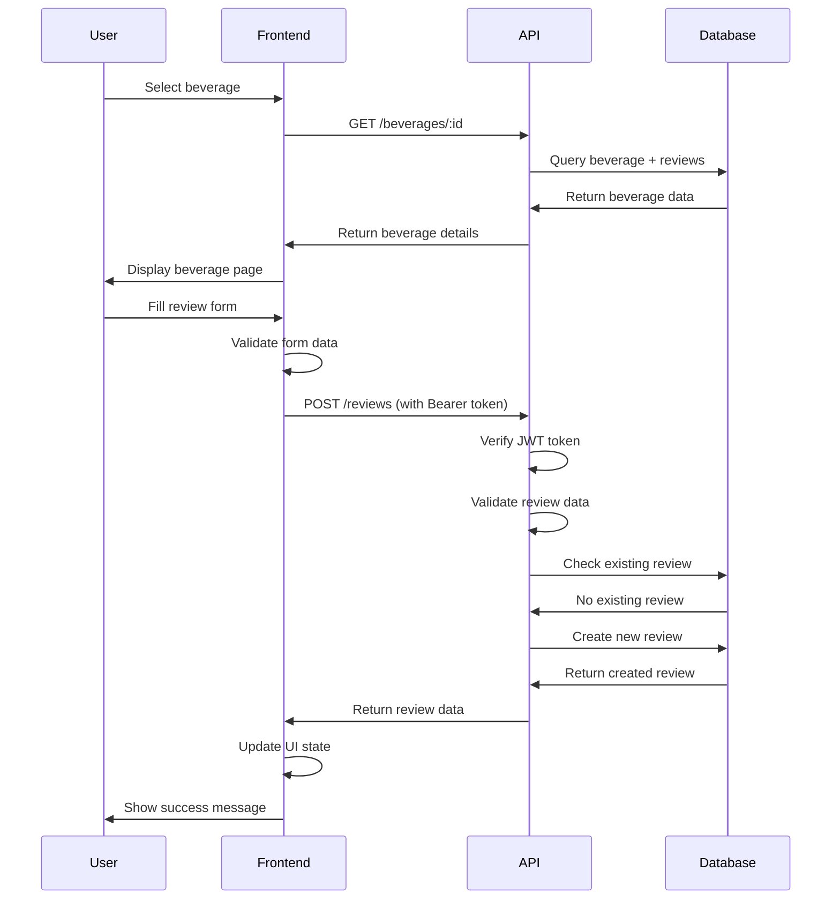
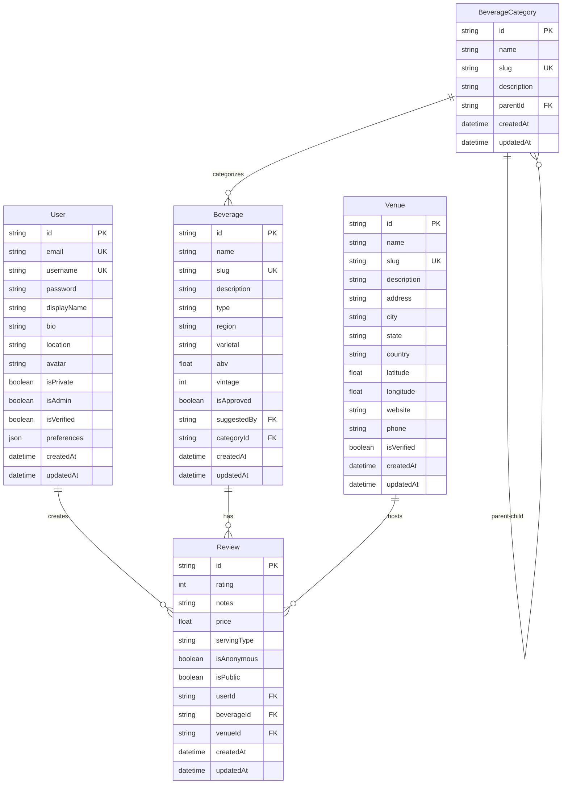
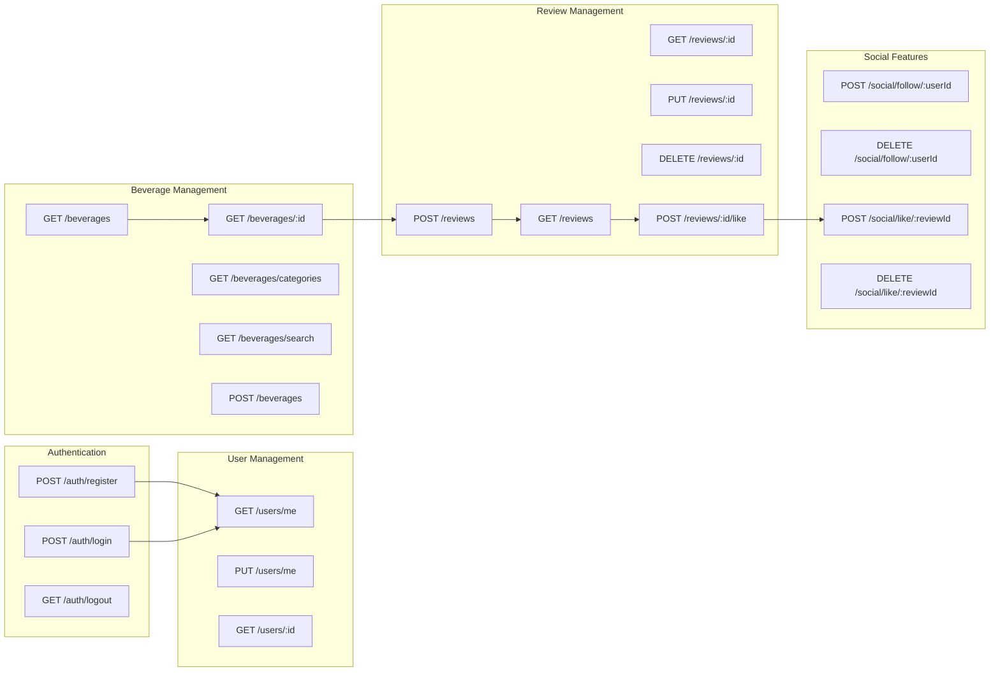
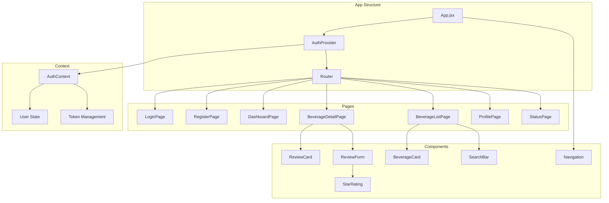
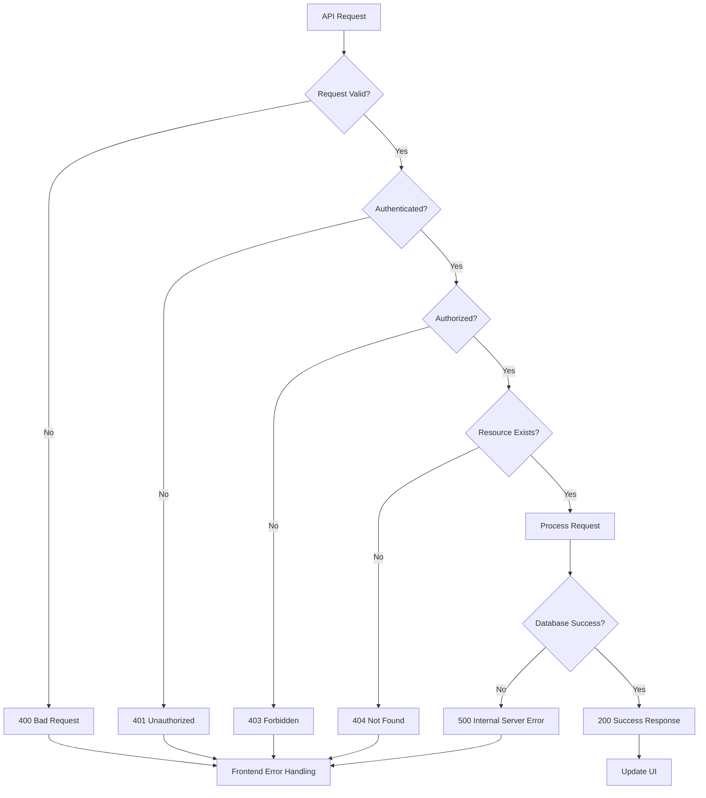
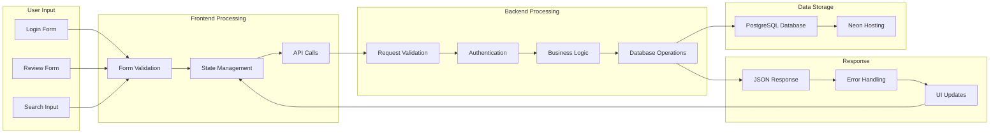

# Wine & Cocktail Review Platform - Application Flow

## System Architecture Overview



## Complete User Journey Flow

```mermaid
flowchart TD
    A[User Visits App] --> B{Authenticated?}

    B -->|No| C[Landing Page]
    B -->|Yes| D[Dashboard]

    C --> E[Login/Register]
    E --> F[Authentication Process]
    F --> G{JWT Token Valid?}

    G -->|No| H[Login Failed]
    G -->|Yes| I[Token Stored in localStorage]

    I --> D
    D --> J[Browse Beverages]
    D --> K[View Profile]
    D --> L[Search Reviews]

    J --> M[Select Beverage]
    M --> N[Beverage Detail Page]
    N --> O{User Reviewed This?}

    O -->|No| P[Review Form]
    O -->|Yes| Q[View Existing Review]

    P --> R[Rate (1-5 Stars)]
    R --> S[Add Notes]
    S --> T[Set Price/Serving Type]
    T --> U[Submit Review]

    U --> V[API: POST /reviews]
    V --> W[Database: Create Review]
    W --> X[Update UI]

    Q --> Y[Edit Review]
    Y --> Z[API: PUT /reviews/:id]
    Z --> W

    N --> AA[View All Reviews]
    AA --> BB[Like/Unlike Reviews]
    BB --> CC[API: POST /reviews/:id/like]

    K --> DD[Profile Management]
    DD --> EE[Update Profile]
    EE --> FF[API: PUT /users/me]

    L --> GG[Search & Filter]
    GG --> HH[API: GET /beverages/search]
    HH --> II[Display Results]
```

## Authentication Flow



## Review Creation Flow



## Database Schema Relationships



## API Endpoints Flow



## Frontend Component Architecture



## Error Handling Flow



## Data Flow Summary



This diagram shows the complete flow of the Wine & Cocktail Review Platform, from user authentication through beverage browsing, review creation, and social interactions. The system uses a modern stack with React frontend, Fastify backend, Prisma ORM, and PostgreSQL database hosted on Neon.