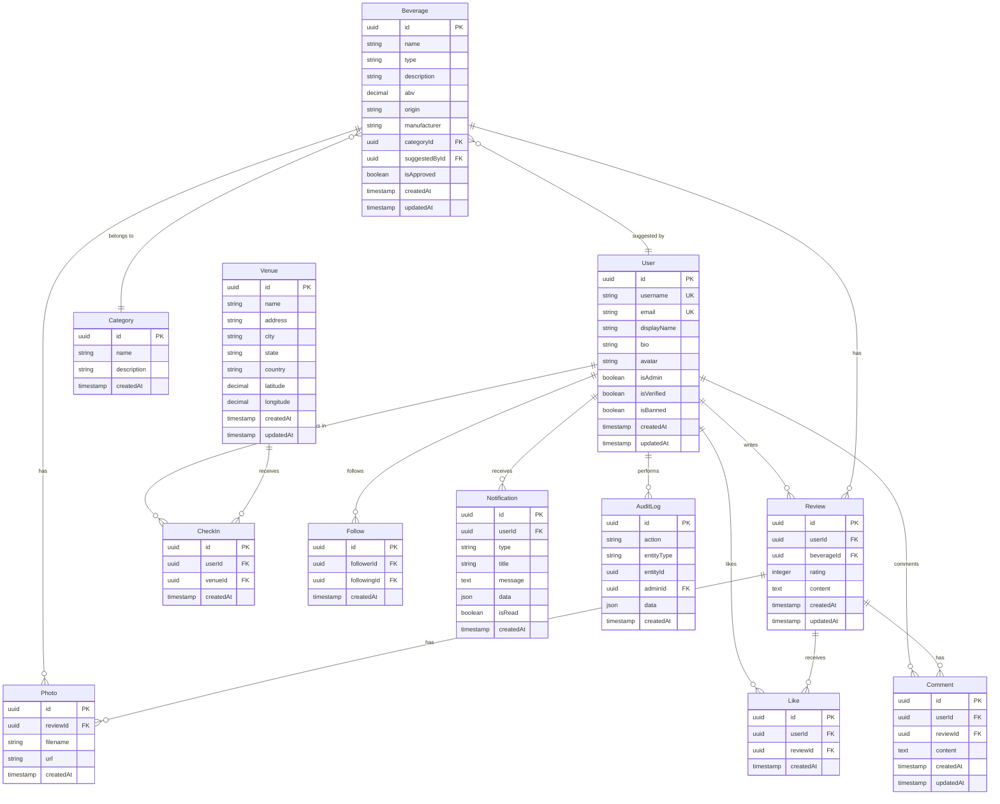

# System Architecture Documentation
## Wine, Cocktail, and Spirit Review Platform

### Version: 2.2
### Status: Production Ready (Search & Discovery Complete)
### Last Updated: July 2025

---

## 1. System Overview

The Wine, Cocktail, and Spirit Review Platform is a full-stack web application built with modern technologies to provide a comprehensive social platform for beverage enthusiasts. The system has successfully completed all planned phases and is now production-ready.

### Recent Technical Improvements (July 2025)
- 🔧 **Social Routes Authentication**: Fixed authentication middleware application to individual routes instead of global plugin middleware
- 🔧 **API Response Standardization**: Updated social endpoints to return consistent response formats matching frontend expectations
- 🔧 **Error Handling**: Improved error messages and validation for social features
- 🔧 **Database Schema**: Fixed beverage category creation to include required fields
- 🆕 **Search & Discovery System**: Implemented comprehensive search endpoints with advanced filtering, sorting, and validation

### 1.1 Architecture Pattern
- **Monorepo Structure**: Shared packages and types
- **API-First Design**: RESTful API with React frontend
- **Microservices Ready**: Modular design for future scaling
- **Event-Driven**: Real-time notifications and updates

### 1.2 Technology Stack

#### Backend
- **Framework**: Fastify (high-performance Node.js)
- **Database**: PostgreSQL with Prisma ORM
- **Authentication**: JWT with bcrypt password hashing
- **File Storage**: Local storage with cloud integration
- **Image Processing**: Sharp for optimization
- **Validation**: Joi for request validation

#### Frontend
- **Framework**: React 18 with Vite
- **Styling**: Tailwind CSS
- **State Management**: React Query + Context API
- **Routing**: React Router v6
- **Build Tool**: Vite for fast development

#### Development
- **TypeScript**: Full type safety
- **Testing**: Jest + React Testing Library
- **Linting**: ESLint + Prettier
- **Version Control**: Git with conventional commits

---

## 2. System Architecture

### 2.1 High-Level Architecture

```
┌─────────────────┐    ┌─────────────────┐    ┌─────────────────┐
│   React App     │    │   Fastify API   │    │   PostgreSQL    │
│   (Frontend)    │◄──►│   (Backend)     │◄──►│   (Database)    │
└─────────────────┘    └─────────────────┘    └─────────────────┘
         │                       │                       │
         │                       │                       │
         ▼                       ▼                       ▼
┌─────────────────┐    ┌─────────────────┐    ┌─────────────────┐
│   File Storage  │    │   Image Proc.   │    │   Audit Logs    │
│   (Local/Cloud) │    │   (Sharp)       │    │   (Admin)       │
└─────────────────┘    └─────────────────┘    └─────────────────┘
```

### 2.2 Component Architecture

#### 2.2.1 Frontend Components
```
src/
├── components/
│   ├── layout/           # Layout components
│   │   ├── Navbar.jsx
│   │   └── Footer.jsx
│   ├── auth/            # Authentication components
│   │   ├── LoginForm.jsx
│   │   └── RegisterForm.jsx
│   ├── beverage/        # Beverage-related components
│   │   ├── BeverageCard.jsx
│   │   ├── BeverageList.jsx
│   │   └── ReviewForm.jsx
│   ├── social/          # Social feature components
│   │   ├── LikeButton.jsx
│   │   ├── FollowButton.jsx
│   │   ├── CommentForm.jsx
│   │   └── CommentList.jsx
│   ├── upload/          # File upload components
│   │   ├── PhotoUpload.jsx
│   │   └── PhotoGallery.jsx
│   ├── venue/           # Venue components
│   │   ├── VenueList.jsx
│   │   └── VenueCard.jsx
│   ├── notification/    # Notification components
│   │   ├── NotificationBell.jsx
│   │   └── NotificationPreferences.jsx
│   └── admin/           # Admin components
│       ├── AdminLayout.jsx
│       ├── AdminDashboard.jsx
│       ├── UserManagement.jsx
│       ├── PendingBeverages.jsx
│       └── AuditLogs.jsx
├── pages/               # Page components
├── contexts/            # React contexts
└── utils/               # Utility functions
```

#### 2.2.2 Backend Structure
```
src/
├── routes/              # API route handlers
│   ├── auth.js         # Authentication routes
│   ├── beverages.js    # Beverage management
│   ├── reviews.js      # Review system
│   ├── social.js       # Social features
│   ├── upload.js       # File uploads
│   ├── venues.js       # Venue management
│   ├── notifications.js # Notification system
│   └── admin.js        # Admin functionality
├── middleware/          # Custom middleware
│   ├── auth.js         # Authentication middleware
│   └── validation.js   # Request validation
├── utils/               # Utility functions
└── index.js            # Server entry point
```

---

## 3. Database Design

### 3.1 Entity Relationship Diagram



### 3.2 Database Schema Details

#### 3.2.1 Core Entities

**Users Table**
- Primary user data with authentication and profile information
- Social features: followers, following, activity tracking
- Admin capabilities: role management, verification status

**Beverages Table**
- Comprehensive beverage catalog with metadata
- Approval system for user-suggested beverages
- Category and type classification

**Reviews Table**
- User-generated reviews with ratings and content
- Photo attachments and social interactions
- Moderation and analytics capabilities

#### 3.2.2 Social Entities

**Follows Table**
- User relationship tracking
- Unique constraints to prevent self-following
- Real-time activity feed generation

**Likes Table**
- Review interaction tracking
- Unique constraints to prevent duplicate likes
- Social engagement metrics

**Comments Table**
- Review discussion system
- User attribution and timestamps
- Moderation and reporting capabilities

#### 3.2.3 Advanced Features

**Photos Table**
- Image metadata and storage references
- Optimization and resizing information
- Gallery and lightbox functionality

**Venues Table**
- Location-based features
- Check-in system integration
- Geographic data and mapping

**Notifications Table**
- Real-time user alerts
- Preference-based filtering
- Email and push notification support

**AuditLogs Table**
- Administrative action tracking
- Security and compliance requirements
- System analytics and reporting

---

## 4. API Design

### 4.1 RESTful API Structure

#### 4.1.1 Authentication Endpoints
```
POST   /auth/register     # User registration
POST   /auth/login        # User login
GET    /auth/profile      # Get user profile
PUT    /auth/profile      # Update user profile
```

#### 4.1.2 Beverage Endpoints
```
GET    /beverages         # List beverages with filters
POST   /beverages         # Create new beverage
GET    /beverages/:id     # Get beverage details
PUT    /beverages/:id     # Update beverage
DELETE /beverages/:id     # Delete beverage
GET    /beverages/categories # List categories
GET    /beverages/search  # Search beverages
```

#### 4.1.3 Review Endpoints
```
GET    /reviews           # List reviews with filters
POST   /reviews           # Create new review
GET    /reviews/:id       # Get review details
PUT    /reviews/:id       # Update review
DELETE /reviews/:id       # Delete review
```

#### 4.1.4 Social Endpoints (All Require Authentication)
```
POST   /social/follow/:userId     # Follow user
DELETE /social/follow/:userId     # Unfollow user
GET    /social/follow/check/:userId # Check follow status
GET    /social/followers/:userId  # Get user followers
GET    /social/following/:userId  # Get user following
POST   /social/like/:reviewId     # Like review
DELETE /social/like/:reviewId     # Unlike review
GET    /social/like/check/:reviewId # Check like status
POST   /social/comment            # Add comment
GET    /social/comments/:reviewId # Get comments for review
```

**Authentication Implementation:**
- Individual route middleware (`{ preHandler: authenticateToken }`)
- JWT token validation on each request
- User context properly set on `request.user`
- Standardized response formats for frontend compatibility

#### 4.1.5 Venue Endpoints
```
GET    /venues            # List venues with filters
POST   /venues            # Create new venue
GET    /venues/:id        # Get venue details
PUT    /venues/:id        # Update venue
DELETE /venues/:id        # Delete venue
POST   /venues/:id/checkin # Check in to venue
```

#### 4.1.6 Notification Endpoints
```
GET    /notifications     # Get user notifications
PUT    /notifications/:id/read # Mark as read
GET    /notifications/preferences # Get preferences
PUT    /notifications/preferences # Update preferences
```

#### 4.1.7 Admin Endpoints
```
GET    /admin/dashboard   # Get admin dashboard stats
GET    /admin/users       # List users with filters
PUT    /admin/users/:userId # Update user (ban/unban, roles)
GET    /admin/beverages/pending # Get pending approvals
PUT    /admin/beverages/:id/approve # Approve/reject beverage
GET    /admin/audit-logs  # Get audit logs
DELETE /admin/content/:type/:id # Delete content
```

#### 4.1.8 Upload Endpoints
```
POST   /upload/image      # Upload image with optimization
DELETE /upload/image/:filename # Delete uploaded image
```

#### 4.1.9 Search Endpoints
```
GET    /search/beverages  # Search beverages with filters
GET    /search/venues     # Search venues with location filters
GET    /search/reviews    # Search reviews with content filters
GET    /search/users      # Search users with activity filters
GET    /search/global     # Global search across all content types
```

### 4.2 API Response Format

#### 4.2.1 Success Response
```json
{
  "success": true,
  "data": {
    // Response data
  },
  "message": "Operation successful",
  "pagination": {
    "page": 1,
    "limit": 20,
    "total": 100,
    "totalPages": 5
  }
}
```

#### 4.2.2 Error Response
```json
{
  "success": false,
  "error": {
    "code": "VALIDATION_ERROR",
    "message": "Invalid input data",
    "details": {
      "field": "email",
      "message": "Email is required"
    }
  }
}
```

### 4.3 Authentication & Authorization

#### 4.3.1 JWT Token Structure
```json
{
  "id": "user-uuid",
  "username": "user123",
  "isAdmin": false,
  "iat": 1640995200,
  "exp": 1641081600
}
```

#### 4.3.2 Authorization Levels
- **Public**: No authentication required
- **User**: Authenticated user required
- **Admin**: Admin privileges required
- **Owner**: Resource owner or admin required

---

## 5. Frontend Architecture

### 5.1 Component Hierarchy

```
App
├── AuthProvider (Context)
├── Navbar
├── Routes
│   ├── HomePage
│   ├── LoginPage
│   ├── RegisterPage
│   ├── DashboardPage
│   ├── ProfilePage
│   ├── BeverageDetailPage
│   ├── SearchPage
│   └── Admin Routes
│       ├── AdminLayout
│       ├── AdminDashboard
│       ├── UserManagement
│       ├── PendingBeverages
│       └── AuditLogs
└── Footer
```

### 5.2 State Management

#### 5.2.1 Context API
- **AuthContext**: User authentication and profile state
- **NotificationContext**: Real-time notification management
- **ThemeContext**: UI theme and preferences

#### 5.2.2 React Query
- **Server State**: API data caching and synchronization
- **Optimistic Updates**: Real-time UI updates
- **Background Refetching**: Automatic data updates

### 5.3 Routing Structure

#### 5.3.1 Public Routes
- `/` - Home page
- `/login` - User login
- `/register` - User registration
- `/beverages` - Beverage catalog
- `/beverages/:id` - Beverage details
- `/search` - Search functionality

#### 5.3.2 Protected Routes
- `/dashboard` - User dashboard
- `/profile/:username` - User profiles
- `/review/:id` - Review details
- `/venues` - Venue listing

#### 5.3.3 Admin Routes
- `/admin` - Admin dashboard
- `/admin/users` - User management
- `/admin/beverages/pending` - Beverage approvals
- `/admin/audit-logs` - Audit logs

---

## 6. Security Architecture

### 6.1 Authentication Security

#### 6.1.1 Password Security
- **Hashing**: bcrypt with salt rounds
- **Validation**: Strong password requirements
- **Storage**: Secure password storage

#### 6.1.2 Token Security
- **JWT**: Secure token generation
- **Expiration**: Configurable token lifetime
- **Refresh**: Token refresh mechanism
- **Storage**: Secure client-side storage

### 6.2 API Security

#### 6.2.1 Input Validation
- **Request Validation**: Joi schema validation
- **SQL Injection**: Parameterized queries
- **XSS Protection**: Input sanitization
- **CSRF Protection**: Token-based protection

#### 6.2.2 Rate Limiting
- **API Limits**: Request rate limiting
- **User Limits**: Per-user rate limiting
- **IP Limits**: IP-based rate limiting

### 6.3 Data Protection

#### 6.3.1 Data Encryption
- **At Rest**: Database encryption
- **In Transit**: HTTPS/TLS encryption
- **Sensitive Data**: Field-level encryption

#### 6.3.2 Privacy Compliance
- **GDPR**: Data protection compliance
- **User Consent**: Clear privacy policies
- **Data Portability**: User data export
- **Right to Deletion**: Account deletion

---

## 7. Performance Architecture

### 7.1 Database Performance

#### 7.1.1 Indexing Strategy
- **Primary Keys**: UUID-based primary keys
- **Foreign Keys**: Indexed foreign key relationships
- **Search Indexes**: Full-text search capabilities
- **Composite Indexes**: Multi-column optimizations

#### 7.1.2 Query Optimization
- **Connection Pooling**: Database connection management
- **Query Caching**: Result set caching
- **Lazy Loading**: On-demand data loading
- **Pagination**: Efficient pagination implementation

### 7.2 API Performance

#### 7.2.1 Response Optimization
- **Compression**: Gzip response compression
- **Caching**: HTTP caching headers
- **Pagination**: Efficient pagination
- **Filtering**: Optimized filtering

#### 7.2.2 Load Balancing
- **Horizontal Scaling**: Multiple API instances
- **Load Distribution**: Request distribution
- **Health Checks**: Instance health monitoring
- **Auto-scaling**: Automatic scaling

### 7.3 Frontend Performance

#### 7.3.1 Bundle Optimization
- **Code Splitting**: Route-based code splitting
- **Tree Shaking**: Unused code elimination
- **Minification**: Code and asset minification
- **Compression**: Asset compression

#### 7.3.2 Caching Strategy
- **Browser Caching**: Static asset caching
- **Service Worker**: Offline functionality
- **CDN**: Content delivery network
- **Image Optimization**: WebP and responsive images

---

## 8. Monitoring & Observability

### 8.1 Application Monitoring

#### 8.1.1 Performance Monitoring
- **Response Times**: API response time tracking
- **Error Rates**: Error rate monitoring
- **Throughput**: Request throughput tracking
- **Resource Usage**: CPU, memory, disk usage

#### 8.1.2 User Experience Monitoring
- **Page Load Times**: Frontend performance
- **User Interactions**: User behavior tracking
- **Error Tracking**: Client-side error monitoring
- **Real User Monitoring**: RUM data collection

### 8.2 Logging Strategy

#### 8.2.1 Structured Logging
- **Request Logs**: API request/response logging
- **Error Logs**: Error tracking and debugging
- **Audit Logs**: Security and compliance logging
- **Performance Logs**: Performance metrics logging

#### 8.2.2 Log Management
- **Centralized Logging**: Log aggregation
- **Log Retention**: Configurable retention policies
- **Log Analysis**: Automated log analysis
- **Alerting**: Automated alerting system

---

## 9. Deployment Architecture

### 9.1 Environment Strategy

#### 9.1.1 Development Environment
- **Local Development**: Docker-based local setup
- **Hot Reloading**: Fast development iteration
- **Debug Tools**: Comprehensive debugging tools
- **Test Data**: Seeded test data

#### 9.1.2 Staging Environment
- **Production-like**: Staging environment setup
- **Testing**: Integration and E2E testing
- **Performance Testing**: Load and stress testing
- **Security Testing**: Security vulnerability testing

#### 9.1.3 Production Environment
- **High Availability**: Multi-region deployment
- **Auto-scaling**: Automatic scaling capabilities
- **Monitoring**: Comprehensive monitoring
- **Backup**: Automated backup systems

### 9.2 Deployment Options

#### 9.2.1 Platform-as-a-Service
- **Vercel**: Full-stack deployment
- **Railway**: Easy deployment with PostgreSQL
- **Render**: Static site + API deployment
- **Heroku**: Traditional PaaS deployment

#### 9.2.2 Infrastructure-as-a-Service
- **AWS**: Comprehensive cloud services
- **Google Cloud**: Google Cloud Platform
- **Azure**: Microsoft Azure services
- **DigitalOcean**: Simple VPS deployment

#### 9.2.3 Container Deployment
- **Docker**: Containerized deployment
- **Kubernetes**: Orchestrated container deployment
- **Docker Compose**: Local container orchestration
- **Cloud Native**: Cloud-native deployment

---

## 10. Testing Architecture

### 10.1 Testing Strategy

#### 10.1.1 Unit Testing
- **Backend**: API endpoint unit tests
- **Frontend**: Component unit tests
- **Utilities**: Helper function tests
- **Database**: Query and model tests

#### 10.1.2 Integration Testing
- **API Integration**: End-to-end API testing
- **Database Integration**: Data flow testing
- **Authentication**: Auth flow testing
- **File Upload**: Upload functionality testing

#### 10.1.3 End-to-End Testing
- **User Journeys**: Complete user flow testing
- **Cross-browser**: Multi-browser compatibility
- **Mobile Testing**: Responsive design testing
- **Performance Testing**: Load and stress testing

### 10.2 Testing Tools

#### 10.2.1 Backend Testing
- **Jest**: Unit and integration testing
- **Supertest**: API endpoint testing
- **Prisma**: Database testing utilities
- **Mocking**: Comprehensive mocking strategy

#### 10.2.2 Frontend Testing
- **React Testing Library**: Component testing
- **Jest**: Unit testing framework
- **Playwright**: End-to-end testing
- **Lighthouse**: Performance testing

---

## 11. Future Architecture Considerations

### 11.1 Scalability Planning

#### 11.1.1 Microservices Architecture
- **Service Decomposition**: Break down into microservices
- **API Gateway**: Centralized API management
- **Service Discovery**: Dynamic service discovery
- **Load Balancing**: Service load balancing

#### 11.1.2 Event-Driven Architecture
- **Event Streaming**: Apache Kafka integration
- **Event Sourcing**: Event-sourced data models
- **CQRS**: Command Query Responsibility Segregation
- **Real-time Processing**: Real-time event processing

### 11.2 Advanced Features

#### 11.2.1 Real-time Features
- **WebSocket**: Real-time communication
- **Server-Sent Events**: Event streaming
- **GraphQL Subscriptions**: Real-time GraphQL
- **Push Notifications**: Mobile push notifications

#### 11.2.2 AI/ML Integration
- **Recommendation Engine**: ML-based recommendations
- **Content Moderation**: AI-powered moderation
- **Image Recognition**: Automated image tagging
- **Sentiment Analysis**: Review sentiment analysis

---

## 12. Conclusion

The Wine, Cocktail, and Spirit Review Platform has successfully implemented a comprehensive, production-ready architecture that supports all planned features and provides a solid foundation for future growth and scaling.

### Key Architectural Achievements
- ✅ **Modular Design**: Clean separation of concerns
- ✅ **Scalable Architecture**: Ready for horizontal scaling
- ✅ **Security-First**: Comprehensive security measures
- ✅ **Performance Optimized**: Fast and efficient operations
- ✅ **Testing Strategy**: Comprehensive testing coverage
- ✅ **Monitoring Ready**: Full observability implementation
- ✅ **Deployment Ready**: Multiple deployment options
- ✅ **Future-Proof**: Architecture supports future enhancements

The system is now ready for production deployment and can serve the beverage community effectively while maintaining high performance, security, and reliability standards.