# System Architecture Documentation

This document provides comprehensive Mermaid diagrams showing how the Wine, Cocktail, and Spirit Review Platform functions, including the newly implemented social features.

## 1. System Architecture Overview

## 2. User Journey Flow

## 3. Authentication Flow

```mermaid
sequenceDiagram
    participant U as User
    participant F as Frontend
    participant A as API
    participant D as Database

    U->>F: Register/Login
    F->>A: POST /auth/register or /auth/login
    A->>D: Create/Verify User
    D-->>A: User Data
    A->>A: Generate JWT Token
    A-->>F: JWT Token + User Data
    F->>F: Store Token in Context
    F-->>U: Redirect to Dashboard

    Note over U,F: Social Features Require Authentication
    U->>F: Follow User
    F->>A: POST /social/follow/:userId (with JWT)
    A->>A: Verify JWT Token
    A->>D: Create Follow Relationship
    D-->>A: Success
    A-->>F: Updated Follow Status
    F-->>U: UI Updates (Follow → Unfollow)
```

## 4. Review Creation Flow

## 5. Social Features Flow

## 6. Database Schema Relationships

## 7. API Endpoints Architecture

## 8. Frontend Component Architecture

## 9. Error Handling & Data Flow

## 10. Social Features Data Flow Summary

## 11. Current Implementation Status

### ✅ Completed Features
- **Authentication System**: JWT-based auth with bcrypt hashing
- **Beverage Management**: Full CRUD operations with search and filtering
- **Review System**: Star ratings, tasting notes, photo support
- **Social Features**: Follow/unfollow, like/unlike, comments
- **User Profiles**: Enhanced profiles with social statistics
- **Real-time UI**: Immediate updates for social actions

### 🔄 In Progress
- **Photo Uploads**: Image upload system for reviews
- **Venue Integration**: Check-in system and venue database
- **Advanced Search**: Enhanced filtering and recommendations
- **Admin Dashboard**: Content moderation tools

### 📋 Planned Features
- **Mobile App**: React Native implementation
- **Gamification**: Badges, achievements, leaderboards
- **OAuth Integration**: Google and GitHub login
- **Real-time Features**: WebSocket for live updates

## 12. Technical Stack Summary

- **Frontend**: React 18 + Vite + Tailwind CSS
- **Backend**: Fastify API + Prisma ORM
- **Database**: PostgreSQL (Neon)
- **Authentication**: JWT tokens with bcrypt
- **Social Features**: Real-time UI updates with state management
- **Deployment**: Development environment fully functional

The system now provides a complete social platform for wine, cocktail, and spirit enthusiasts with robust authentication, comprehensive beverage management, and engaging social features that encourage community interaction and content creation.